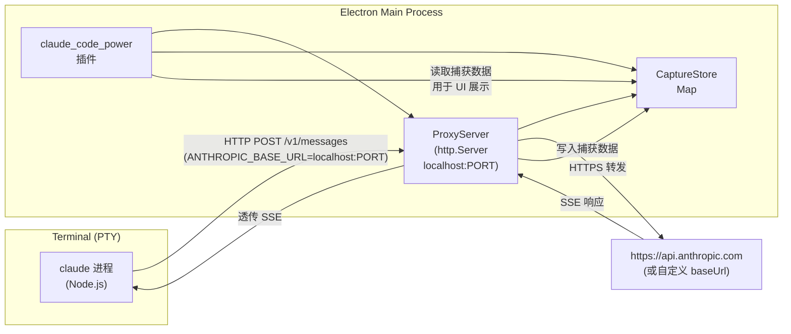
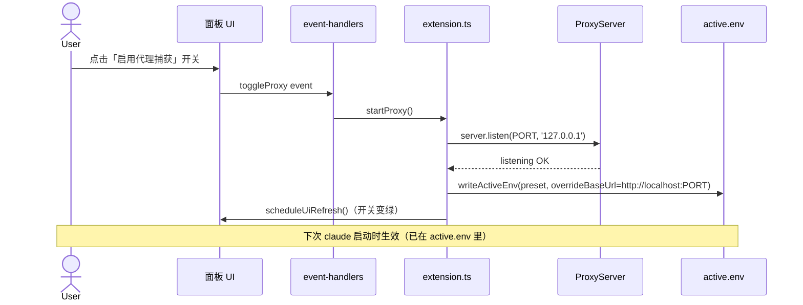
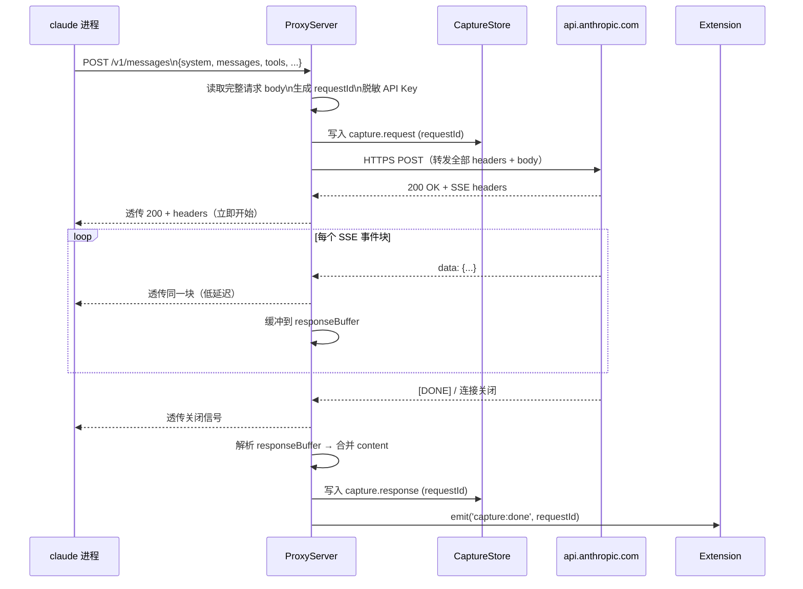
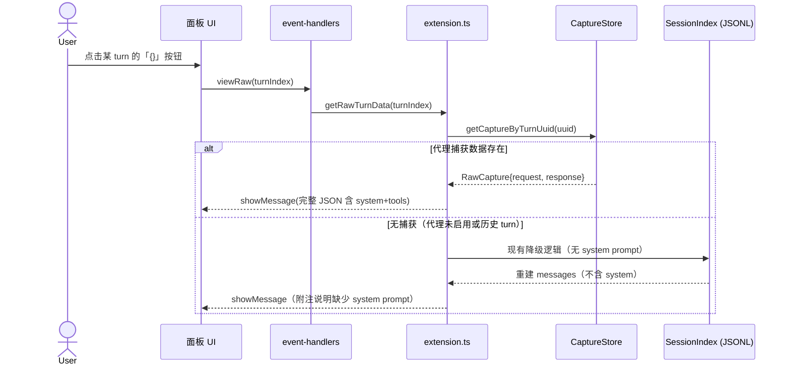

# 20260619-ProxyCapture

**功能**：通过本地反向代理劫持 Claude Code 发往 Anthropic API 的请求，完整捕获 system prompt、messages 数组、tools 定义及 API 原始响应。

---

## 1. 架构设计

### 1.1 整体架构

当前插件在 Electron Main 进程中运行，通过管理 `active.env` 控制 Claude Code 的环境变量（含 `ANTHROPIC_BASE_URL`）。代理功能在此基础上插入一个本地 HTTP 服务，将 Claude Code 的 API 流量引入插件侧再转发给真实端点。

### 1.2 模块说明

| 模块 | 文件（建议） | 职责 |
|------|-------------|------|
| **ProxyServer** | `src/proxy/proxy-server.ts` | 启动/停止本地 HTTP 监听；解析请求体；转发至真实 API；缓冲响应同时透传给 Claude Code |
| **CaptureStore** | `src/proxy/capture-store.ts` | 内存存储已捕获的请求/响应对，按 `sessionId + requestId` 索引；提供按 turn uuid 查询的接口 |
| **ProxyState** | `src/core/state.ts`（扩展） | 增加 `proxyEnabled: boolean` / `proxyPort: number` 状态 |
| **extension.ts**（扩展） | 现有文件 | 控制代理生命周期；在 `writeActiveEnv` 时注入 `ANTHROPIC_BASE_URL=http://localhost:PORT` |
| **event-handlers.ts**（扩展） | 现有文件 | 处理 `toggleProxy` 面板事件 |
| **panel-layout.ts**（扩展） | 现有文件 | 在 compactControls 区增加代理开关；`viewRaw` 弹窗优先读取捕获数据 |

### 1.3 关键约束

- 代理仅监听 `127.0.0.1`，不对外网暴露
- 插件 deactivate 时必须释放端口（`server.close()`）
- API Key / Auth Token 不写入 CaptureStore，捕获数据中替换为 `***`

---

## 2. 关键流程时序图

### 2.1 代理启用流程

### 2.2 请求捕获流程（SSE 流式）

### 2.3 查看原始数据流程

---

## 3. 关键逻辑

### 3.1 SSE 流式响应的透传与缓冲并行

**问题**：Claude Code 使用 SSE 流式接收响应，延迟敏感。如果等响应全部结束再缓冲，不影响延迟；但如果缓冲本身引入背压，会破坏流式体验。

**难点**：`pipe` 是单路，同时写到 CaptureStore 和透传给 Claude Code 需要「分叉」。

**候选方案**：
- A. 用 Node.js `stream.PassThrough` 分叉：response → passthrough，passthrough.pipe(clientRes) + passthrough 另一路 buffer 写 store。**选此方案**——零延迟，背压由 clientRes 侧控制。
- B. 先完整读完 response body 再发给 Claude Code：简单，但 SSE 无法流式输出，用户体验退化。
- C. 每个 chunk 同步写 store 再写 clientRes：顺序保证但 store 写慢时可能引入抖动。

**选 A 的理由**：PassThrough 是 Node.js 内置，零拷贝分叉，对 Claude Code 完全透明，且只有写入 store 一侧有轻微背压（内存操作，可忽略）。

### 3.2 requestId 与 turn uuid 的关联

**问题**：代理层看到的是 HTTP 请求，不知道这属于 JSONL 里的哪个 turn。

**难点**：Claude Code 不在请求里带 turn uuid；JSONL 里的 assistant uuid 是 Claude Code 自己生成的，写入 JSONL 比 API 返回晚。

**候选方案**：
- A. 时间戳匹配：捕获请求时记录 `captureTs`，JSONL 新事件落地时用 `abs(eventTs - captureTs) < 阈值` 关联。**选此方案**——最简单，实测 JSONL 写入比 API 响应完成晚不超过 200ms，用 500ms 阈值可靠。
- B. 响应体中的 `message.id`（`msg_xxx`）：assistant JSONL record 也保存了 `message.id`，可精确匹配。**备选**——更精确，但需要先完整解析响应再关联，略复杂。
- C. 在请求路径里注入 header（修改 Claude Code 发出的请求）：不可行，Claude Code 是黑盒。

**选 A 为主、B 为回退**：先用时间戳关联，若同一秒有多个并发请求（多 tab），再用 `message.id` 精确匹配。

### 3.3 真实 baseUrl 的解析

**问题**：用户的 Preset 可能配置了自定义 `ANTHROPIC_BASE_URL`（公司代理）。代理转发时要发往用户的真实端点，而不是 `api.anthropic.com`。

**方案**：ProxyServer 初始化时接受 `upstreamBaseUrl` 参数（从 PresetStore 的 active preset 读取）。代理启用时，`ANTHROPIC_BASE_URL` 写成 `http://127.0.0.1:PORT`，同时 ProxyServer 内部的转发目标设为用户的原始 `baseUrl`（或默认 `https://api.anthropic.com`）。插件代理层对 Claude Code 完全透明。

### 3.4 代理开关的生命周期与 active.env 回写

**问题**：关闭代理开关后，`ANTHROPIC_BASE_URL` 需要还原，否则 Claude Code 下次启动仍然尝试连本地代理（已关闭的端口）。

**方案**：
- 开启代理：`writeActiveEnv(preset, {overrideBaseUrl: 'http://127.0.0.1:PORT'})`
- 关闭代理：`writeActiveEnv(preset)` 用原 preset 的 baseUrl 覆盖写回
- `server.close()` 在 plugin deactivate 时必须调用，同时触发一次 active.env 还原

---

## 4. 接口说明

### 4.1 ProxyServer 对 Claude Code 暴露的 HTTP 接口

代理透明转发，无自定义接口。Claude Code 发往代理的请求与发往 `api.anthropic.com` 的结构完全一致，代理不修改路径/方法/body。

**监听**：`http://127.0.0.1:{PORT}` （PORT 动态分配，默认尝试 18764，冲突则递增）

### 4.2 CaptureStore 对插件内部暴露的查询接口

| 方法 | 入参 | 返回 | 说明 |
|------|------|------|------|
| `add(capture)` | `RawCapture` | `void` | 写入一条捕获记录 |
| `getByRequestId(id)` | `string` | `RawCapture \| null` | 精确查询 |
| `getByTimeRange(from, to)` | `number, number` | `RawCapture[]` | 时间戳范围查询（用于 turn 关联） |
| `getByMessageId(msgId)` | `string` | `RawCapture \| null` | 按 `message.id`（`msg_xxx`）查询 |
| `clear()` | — | `void` | 清空所有捕获（内存释放） |

**RawCapture 数据结构**

| 字段 | 类型 | 说明 |
|------|------|------|
| `requestId` | `string` | 代理生成的 UUID |
| `captureTs` | `number` | 请求到达代理的时间戳（ms） |
| `request` | `object` | 完整请求体（含 system/messages/tools），API Key 已脱敏 |
| `responseMessageId` | `string \| null` | 响应中的 `message.id`（`msg_xxx`） |
| `response` | `object \| null` | 合并后的完整响应（SSE 合并结果） |
| `responseTs` | `number \| null` | 响应完成时间戳（ms） |
| `upstreamUrl` | `string` | 实际转发到的上游地址 |

### 4.3 面板新增事件

| sectionId | eventId | payload | 说明 |
|-----------|---------|---------|------|
| `controls` | `field-change` | `{fieldId: 'proxyEnabled', value: 'true'/'false'}` | 开关 toggle |

---

## 5. 遗留问题

**P1 — CaptureStore 内存无上限**
当前方案按 Map 存储，session 期间捕获数量无限增长。长时间高频使用会有 OOM 风险。
**本次不做**：功能验证阶段，内存占用尚在可接受范围。
**建议处理时机**：稳定后加 LRU（保留最近 N 条捕获），或持久化到临时文件。

**P2 — 非 POST /v1/messages 的请求未处理**
Claude Code 可能发出其他请求（如 `/v1/models`、`/oauth/...`）。当前代理对所有请求透传，但捕获逻辑只针对 `/v1/messages`。
**本次不做**：非 messages 请求无 system prompt 意义，暂不捕获。
**建议处理时机**：若后续需要分析 model 列表或 token 计算请求时再扩展。

**P3 — 多 Tab 并发请求的 requestId / turn 关联精度**
同一时刻多个 Tab 并发触发 API call 时，时间戳匹配可能误关联。
**本次**：用 `message.id`（`msg_xxx`）作为二级精确匹配键，基本可解决。
**建议处理时机**：若出现误关联 bug 时修复。

**P4 — 代理未启用时的历史 Turn 无法展示完整 system prompt**
viewRaw 的降级路径（无捕获数据）仍然无法展示 system prompt。
**本次不做**：这是 JSONL 的结构性限制，代理方案不影响历史数据。
**建议处理时机**：无解，在 UI 中明确提示。

**P5 — 代理 TLS 终止**
若上游为 HTTPS，代理以 HTTP 接受来自 Claude Code 的连接（loopback 可接受），向上游发 HTTPS（Node.js `https.request`）。但若上游也是 HTTP（某些企业内网代理），需要注意证书校验配置。
**本次**：仅支持 HTTPS 上游的标准场景。
**建议处理时机**：企业内网场景按需添加 `rejectUnauthorized: false` 选项（用户配置）。
